# ♟️🔴 Chess and Connect

**Chess and Connect** es una aplicación web multijugador en tiempo real desarrollada como proyecto del segundo trimestre del ciclo formativo de **Desarrollo de Aplicaciones Multiplataforma (DAM)**.

La plataforma ofrece la posibilidad de jugar a Ajedrez y Conecta 4 en tiempo real, ya sea enfrentándote a otros jugadores conectados o compitiendo contra un bot inteligente. Utiliza tecnología WebSocket para garantizar una experiencia interactiva, fluida y sincronizada. Este proyecto fue desarrollado en equipo con el propósito de afianzar y aplicar conocimientos en desarrollo web fullstack moderno.

---

## 📚 Índice

---

## 🚀 Tecnologías Utilizadas

### 🔙 Backend

| Tecnología                                 | Descripción                                                     |
|--------------------------------------------|-----------------------------------------------------------------|
| **ASP.NET Core 8.0**                       | Framework principal para la API REST y servicios de WebSocket   |
| **C#**                                     | Lenguaje usado para toda la lógica del servidor                 |
| **WebSocket nativo**                       | Comunicación en tiempo real entre jugadores                     |
| **Entity Framework Core**                  | ORM para el cceso a base de datos con SQLite y MySQL            |
| **JWT (Json Web Tokens)**                  | Autenticación de usuarios con tokens seguros                    |
| **Swagger**                                | Documentación interactiva de la API                             |
| **F23.StringSimilarity**                   | Comparación de cadenas para la búsqueda inteligente de usuarios |

### 🔜 Frontend

| Tecnología        | Descripción                                      |
|-------------------|--------------------------------------------------|
| **Angular 19**    | Framework principal para construir toda la interfaz               |
| **TypeScript**    | Tipado estático y desarrollo escalable           |
| **TailwindCSS**   | Estilos rápidos y responsive con clases utilitarias  |
| **RxJS**          | Manejo de eventos y datos en tiempo real                    |
| **SweetAlert2**    | Alertas y diálogos visuales personalizados           |
| **Service Worker (PWA)**    | 	Permite usar la app como progresiva e instalable         |

---

### 📸 Funcionamiento

### Menú

Aquí puedes ver cómo funciona el menú principal de la aplicación. Desde esta vista, el usuario puede acceder a las diferentes secciones del sistema: elegir el modo de juego, administrar su lista de amigos, gestionar peticiones de amistad, entre otras opciones.

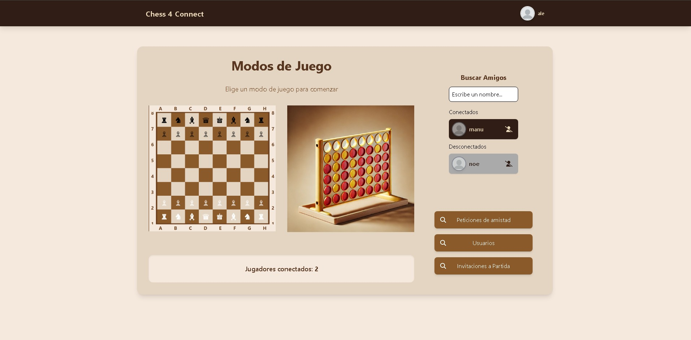

Una de las funciones destacadas es la búsqueda inteligente de amigos. Utiliza una comparación de cadenas para sugerir usuarios cuyos nombres sean similares al texto ingresado.

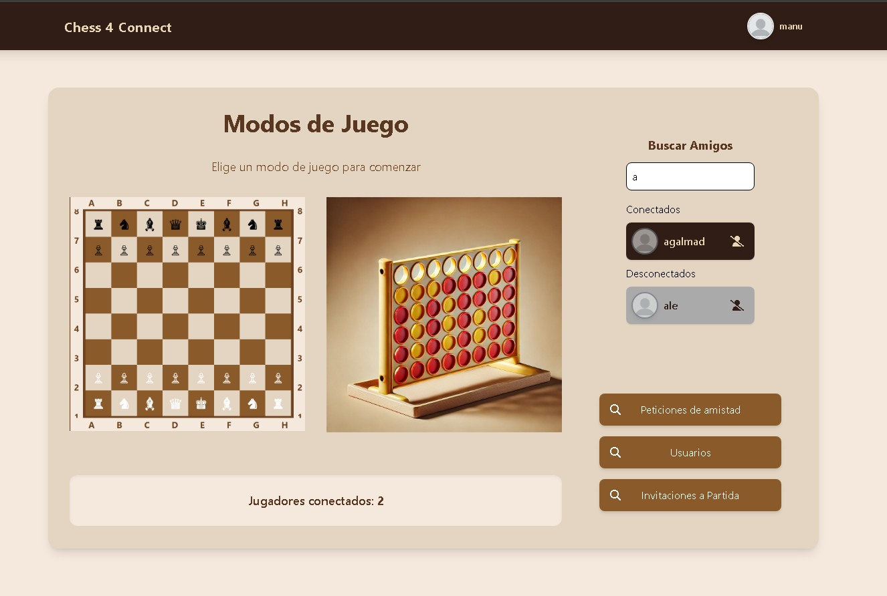

De una manera similar puedes buscar usuarios manualmente y enviarles una solicitud de amistad de forma sencilla.

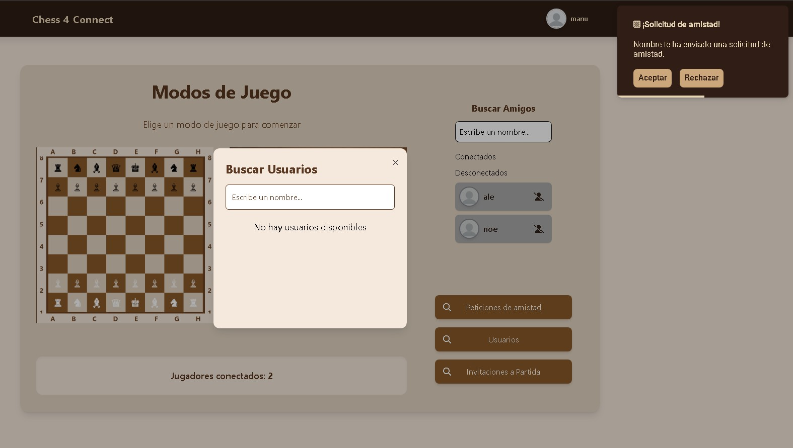

Además, tienes la opción de aceptar o rechazar las solicitudes de amistad recibidas.

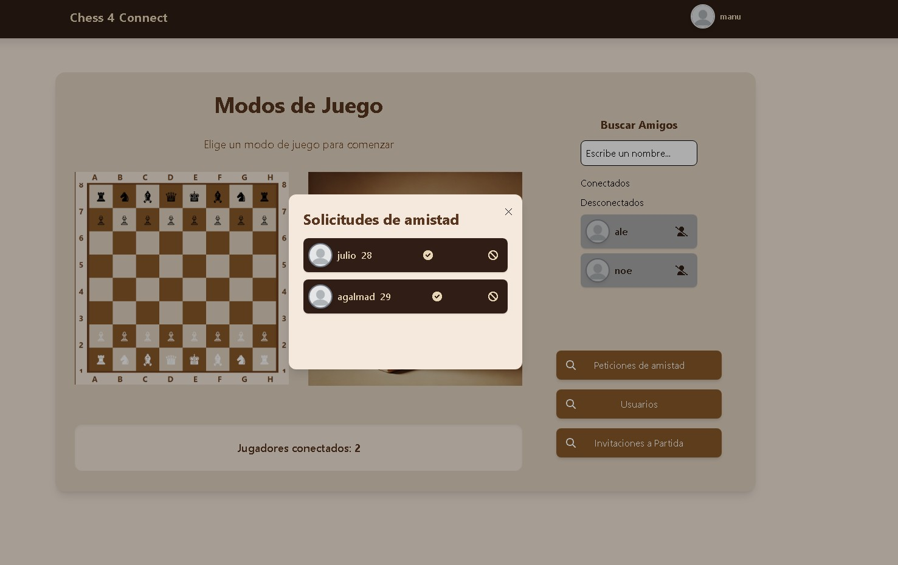

## Juegos

En esta vista puedes elegir el modo en el que quieres jugar. Tienes tres opciones: jugar contra un amigo, enfrentarte a un bot o unirte a la cola para emparejarte automáticamente con otro jugador en línea.

> ℹ️ **Nota:** Tanto en Ajedrez como en Conecta 4, se mantienen las mismas funcionalidades: puedes jugar con un amigo, con un bot o usar el sistema de emparejamiento para encontrar un rival automáticamente.

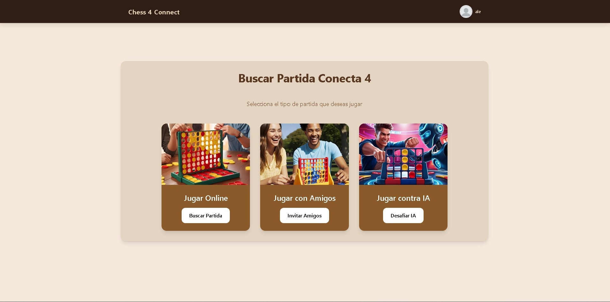
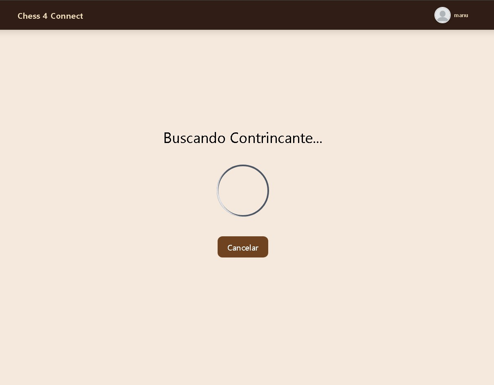
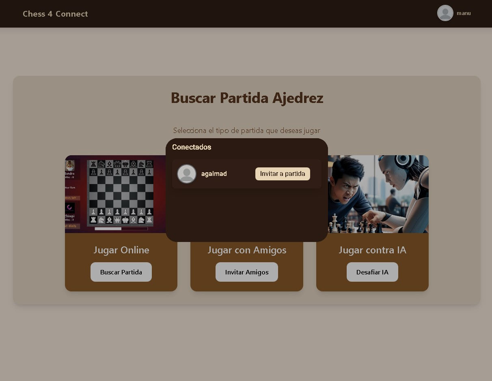

### Ajedrez

En la pantalla del juego verás el tablero con las piezas, orientado según el color de cada jugador. Cada jugador cuenta con un temporizador, y cuando se agota, la partida termina automáticamente.

Al seleccionar una pieza, se muestran todos los movimientos posibles para ayudarte a planificar tu jugada.

También tienes un chat en tiempo real para comunicarte con tu oponente durante la partida.

Puedes solicitar tablas o rendirte en cualquier momento.

Las notificaciones aparecerán en la esquina superior derecha para avisarte si se han solicitado tablas, si tu oponente pide revancha o si se ha desconectado.

Si el oponente se desconecta, automáticamente serás declarado ganador y serás redirigido al menú principal.

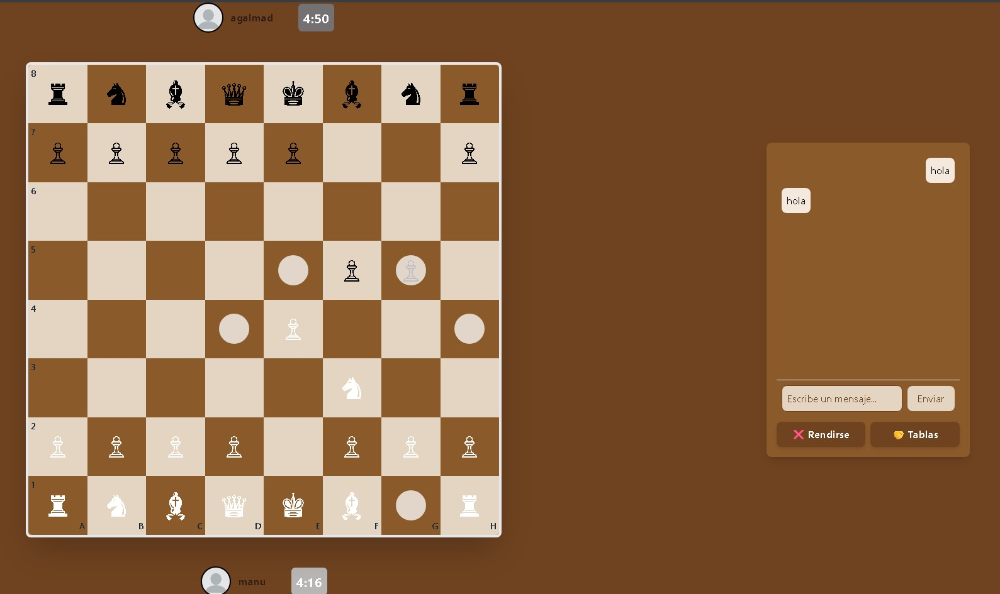
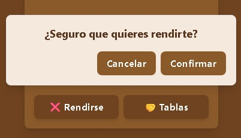
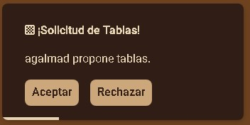
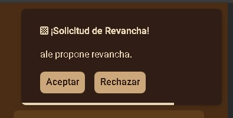

### Conecta 4

> ℹ️ **Nota:** Conecta 4 ofrece las mismas funcionalidades que Ajedrez: puedes jugar contra un amigo, contra un bot o buscar un rival en línea. El tablero y las mecánicas están adaptadas a la lógica propia de este juego, pero la experiencia de usuario, el chat en tiempo real y las notificaciones funcionan igual.

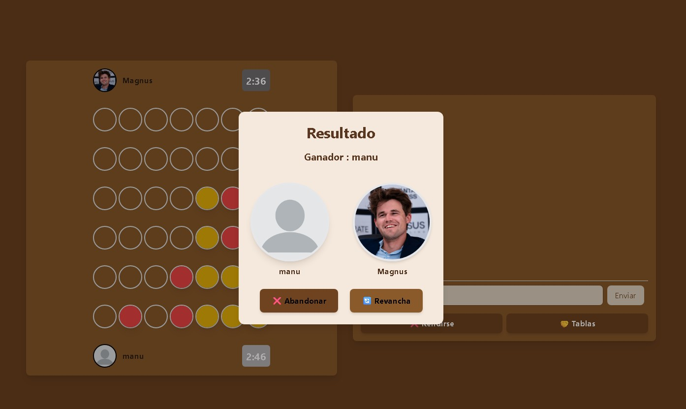

## Vista de Usuario

En esta pantalla puedes ver tu perfil o el de otros jugadores.

Si es tu perfil, podrás modificar todos tus datos personales fácilmente.

Si estás viendo el perfil de otro usuario, tienes la opción de enviarle una solicitud de amistad o eliminarlo de tu lista de amigos.

También cuenta con un historial de partidas, ordenado desde las más recientes hasta las más antiguas.

Puedes alternar entre las partidas de Ajedrez y Conecta 4 usando el botón correspondiente para cada juego.

Además, la vista incluye paginación, que te permite elegir cuántas partidas quieres ver en pantalla y navegar por las páginas con los botones que están en la parte inferior.

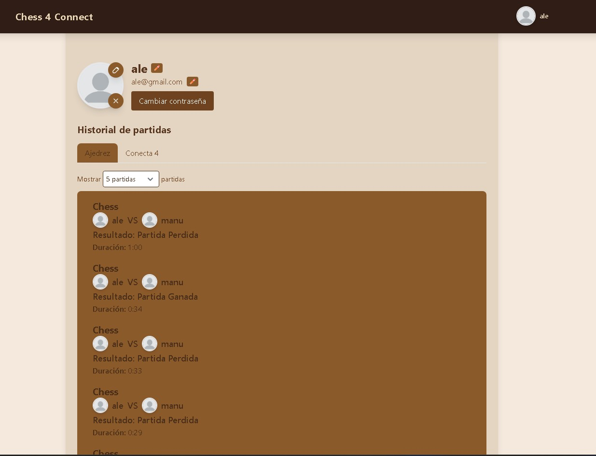
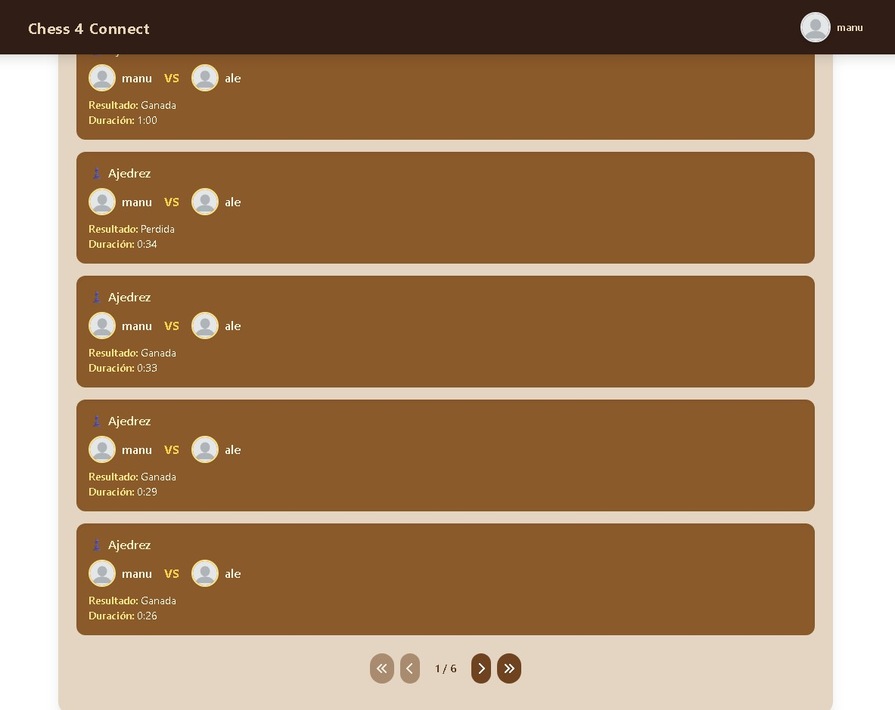
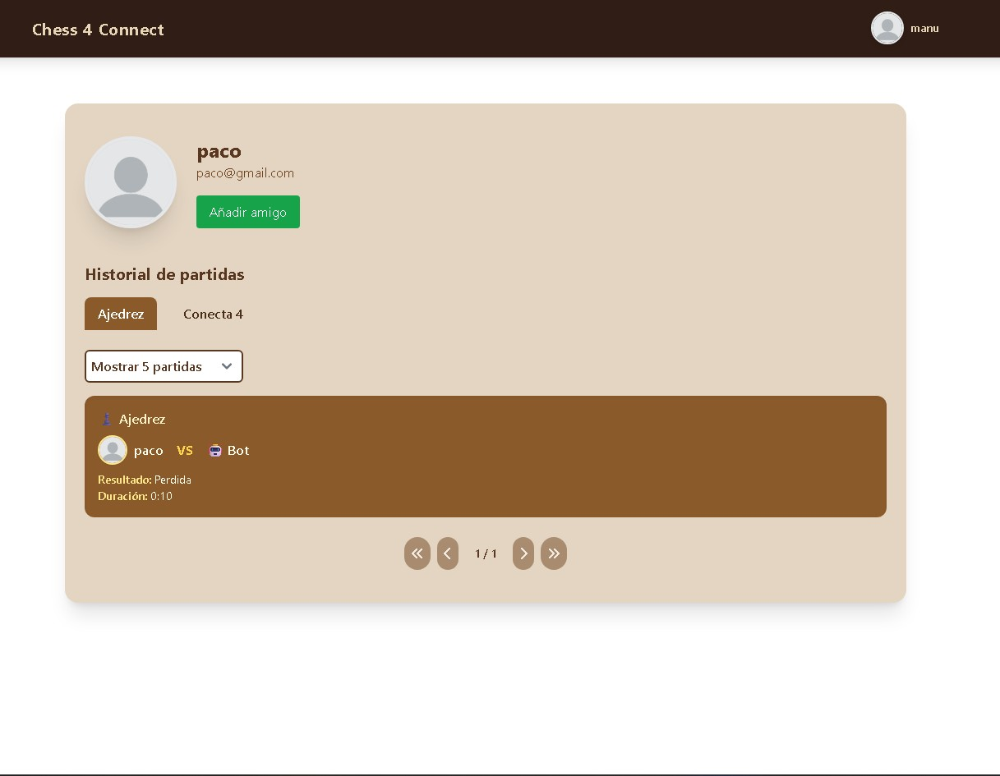
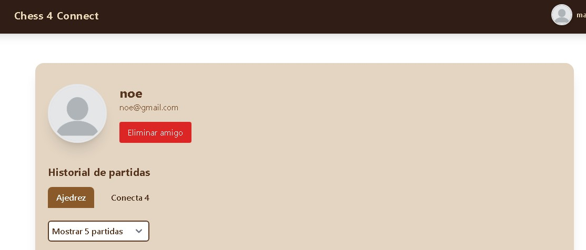

### Administración

Si tienes el rol de administrador, tendrás acceso a una lista completa de todos los usuarios registrados en la plataforma.

Desde aquí puedes cambiar el rol de cualquier usuario o banearlo si es necesario.

Cuando un usuario baneado intenta acceder al juego, solo podrá ver la página principal. Si intenta entrar a cualquier otra sección, se le mostrará una pantalla especial para que pueda apelar el baneo.

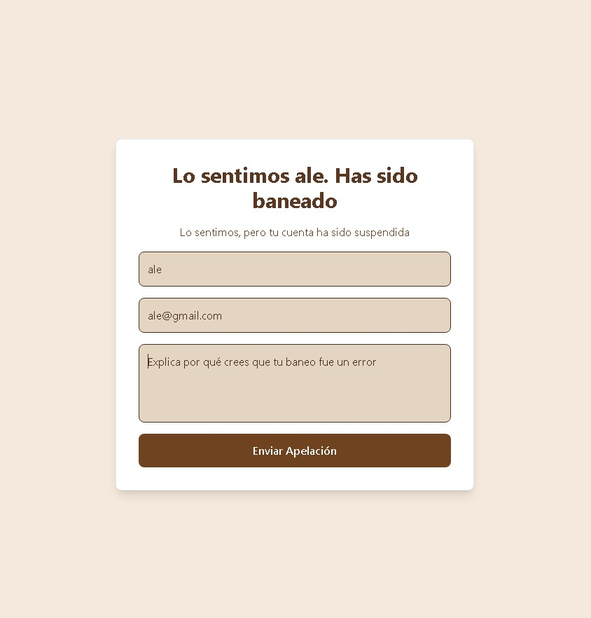

---

### Página Desplegada

La aplicación está desplegada y accesible en línea con la siguiente configuración:

- **Backend:** MonsterASP.NET  
- **Frontend:** Vercel  

[Página desplegada](https://chess-connect-mejora.vercel.app/)

---

## 🧠 Qué Aprendimos

Durante el desarrollo de *Chess and Connect* hemos reforzado conocimientos esenciales como:

- Creación de APIs RESTful seguras con autenticación JWT
- Gestión de WebSockets con ASP.NET Core y comunicación síncrona eficiente
- Diseño y consumo de servicios desde Angular usando RxJS
- Trabajo en equipo con control de versiones y metodologías ágiles
- Implementación de una Progressive Web App (PWA)

## 🔧 Funcionalidades Clave

- 🎮 Juegos de Ajedrez y Conecta 4 en tiempo real
- 👥 Registro, login y gestión de usuarios con JWT
- 🤖 Opción de jugar contra bot (IA básica)
- 💬 Comunicación entre jugadores con sockets
- 📱 Diseño responsive y experiencia fluida en todos los dispositivos
- 🧠 Lógica validada para detección de movimientos y victorias

