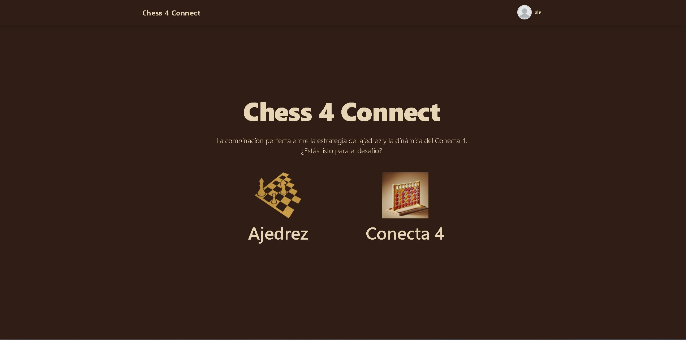
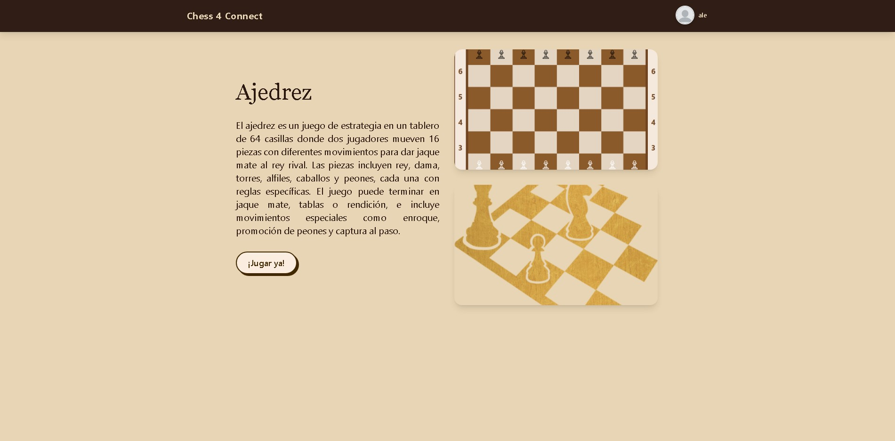
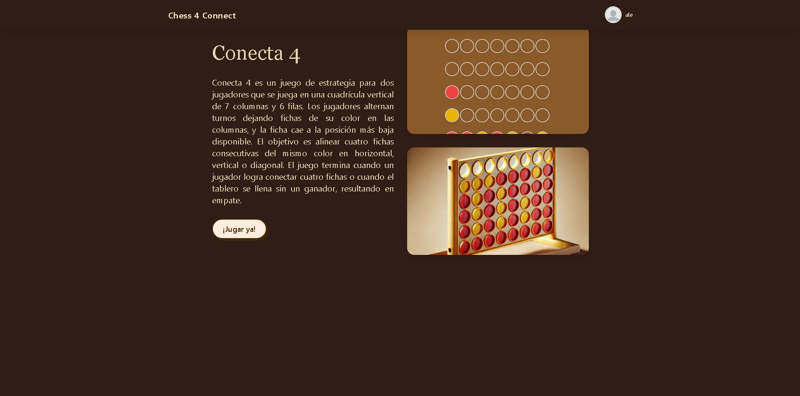
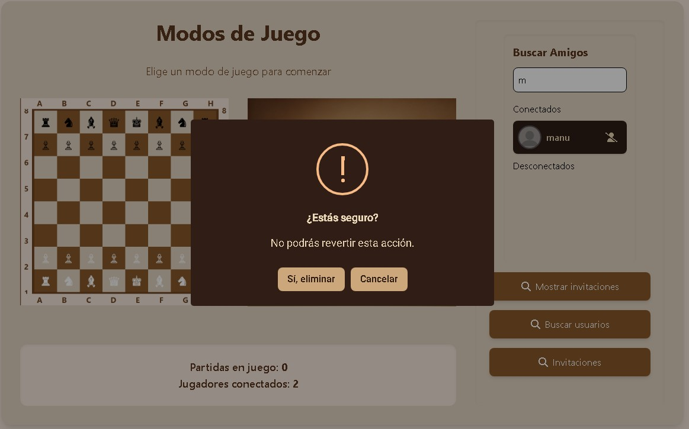
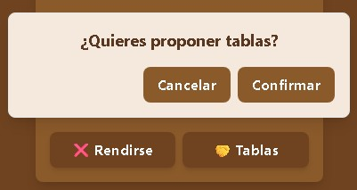
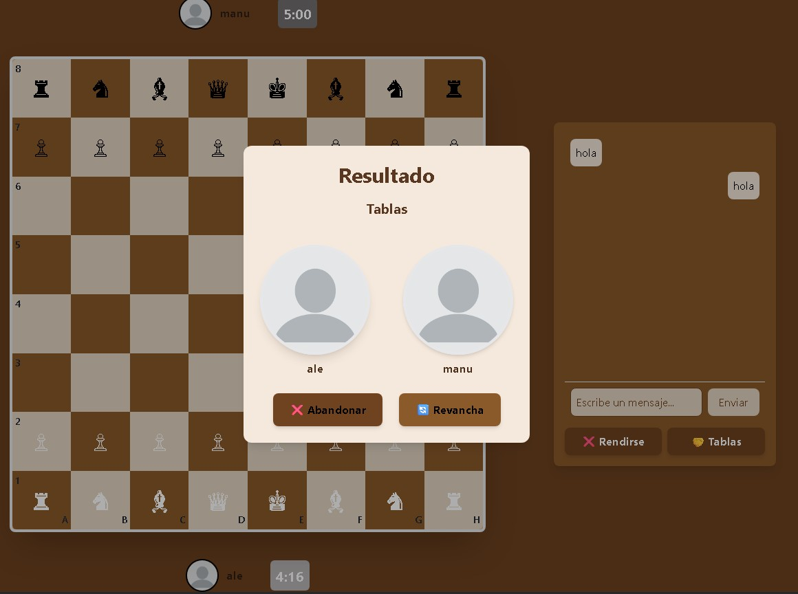
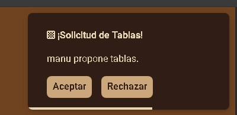
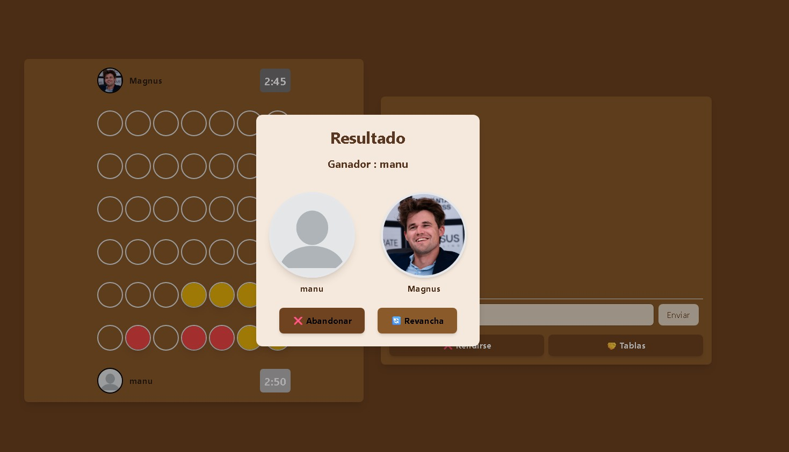

# ♟️🔴 Chess and Connect

**Chess and Connect** es una aplicación web multijugador en tiempo real desarrollada como proyecto del segundo trimestre del ciclo formativo de **Desarrollo de Aplicaciones Multiplataforma (DAM)**.

La plataforma ofrece la posibilidad de jugar a Ajedrez y Conecta 4 en tiempo real, ya sea enfrentándote a otros jugadores conectados o compitiendo contra un bot inteligente. Utiliza tecnología WebSocket para garantizar una experiencia interactiva, fluida y sincronizada. Este proyecto fue desarrollado en equipo con el propósito de afianzar y aplicar conocimientos en desarrollo web fullstack moderno.

---

## 📚 Índice

---

## 🚀 Tecnologías Utilizadas

### 🔙 Backend

| Tecnología                                 | Descripción                                                     |
|--------------------------------------------|-----------------------------------------------------------------|
| **ASP.NET Core 8.0**                       | Framework principal para la API REST y servicios de WebSocket   |
| **C#**                                     | Lenguaje usado para toda la lógica del servidor                 |
| **WebSocket nativo**                       | Comunicación en tiempo real entre jugadores                     |
| **Entity Framework Core**                  | ORM para el cceso a base de datos con SQLite y MySQL            |
| **JWT (Json Web Tokens)**                  | Autenticación de usuarios con tokens seguros                    |
| **Swagger**                                | Documentación interactiva de la API                             |
| **F23.StringSimilarity**                   | Comparación de cadenas para la búsqueda inteligente de usuarios |

### 🔜 Frontend

| Tecnología        | Descripción                                      |
|-------------------|--------------------------------------------------|
| **Angular 19**    | Framework principal para construir toda la interfaz               |
| **TypeScript**    | Tipado estático y desarrollo escalable           |
| **TailwindCSS**   | Estilos rápidos y responsive con clases utilitarias  |
| **RxJS**          | Manejo de eventos y datos en tiempo real                    |
| **SweetAlert2**    | Alertas y diálogos visuales personalizados           |
| **Service Worker (PWA)**    | 	Permite usar la app como progresiva e instalable         |

---

### 🌐 Comunicación en Tiempo Real

---

### 📸 Funcionamiento

**Home Page**

**Game menu**

  
  
  

**Game Dashboard**

**Chess**

**Connect 4**

**User Page**

**Admin Page**

---

## 🧠 Qué Aprendimos

Durante el desarrollo de *Chess and Connect* hemos reforzado conocimientos esenciales como:

- Creación de APIs RESTful seguras con autenticación JWT
- Gestión de WebSockets con ASP.NET Core y comunicación síncrona eficiente
- Diseño y consumo de servicios desde Angular usando RxJS
- Trabajo en equipo con control de versiones y metodologías ágiles
- Implementación de una Progressive Web App (PWA)

## 🔧 Funcionalidades Clave

- 🎮 Juegos de Ajedrez y Conecta 4 en tiempo real
- 👥 Registro, login y gestión de usuarios con JWT
- 🤖 Opción de jugar contra bot (IA básica)
- 💬 Comunicación entre jugadores con sockets
- 📱 Diseño responsive y experiencia fluida en todos los dispositivos
- 🧠 Lógica validada para detección de movimientos y victorias

